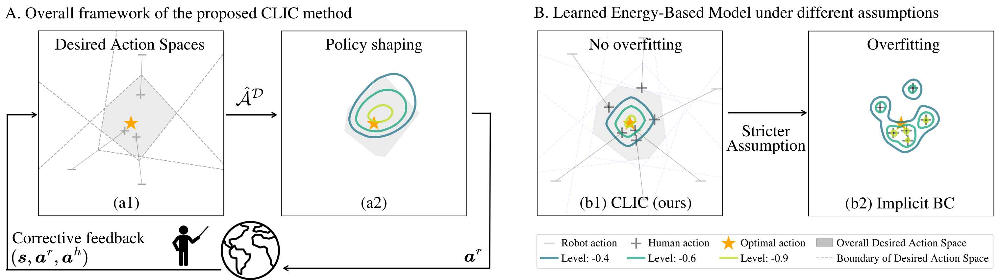

# Beyond Behavior Cloning: Robustness through Interactive Imitation and Contrastive Learning (CLIC)

[](https://clic-webpage.github.io/)
[](https://arxiv.org/abs/2502.07645)



---

## 📜 Overview

This repository provides the official implementation of **CLIC** (Contrastive Learning with Interactive Corrections), a framework that address the overfitting issue of behavior cloning by leveraging human corrections and contrastive objectives.
It includes baselines such as IBC, Diffusion Policy, Ambient Diffusion, BD-COACH, HD-DAgger, and PVP.


## ⚙️  Installation

We support **conda**, **poetry**, and **docker**. The code has been tested on Ubuntu 22.04 and 24.04.

### Conda

```bash
cd CLIC/src
conda env create -f environment.yml
# If issues occur, update:
conda env update -n conda-env-CLIC -f environment.yml --prune
```

> Torch version may depend on your GPU. For newer GPUs (e.g., RTX 5070Ti), you can switch to `environment_cu128.yml`.

### Poetry

```bash
cd CLIC/src
poetry install
```

### Docker

```bash
cd CLIC/
sudo docker build -t clic-image -f dockerfile_CLIC .
```


## 🚀 Training in Simulation
All training scripts are launched via main_IIL.py and configured using Hydra. Configuration files for all algorithms are located in `src/config/
For a detailed guide on the training pipeline, please see this  [ document](./doc/Readme_training_pipeline.md).

### Training CLIC Agents
To train the different variants of CLIC, run the following commands from the `src/` directory:

```bash
# CLIC-Circular
python main_IIL.py --config-name train_CLIC_Circular hydra.run.dir='outputs/${experiment_id}' +GENERAL.render_savefig_flag=true

# CLIC-Half
python main_IIL.py --config-name train_CLIC_Half hydra.run.dir='outputs/${experiment_id}'

# CLIC-Explicit
python main_IIL.py --config-name train_CLIC_Explicit hydra.run.dir='outputs/${experiment_id}'

```


### Training Baselines
To run the baseline algorithms, use their corresponding config files:

```bash
# IBC baseline
python main_IIL.py --config-name train_IBC hydra.run.dir='outputs/${experiment_id}'

# Diffusion Policy baseline
python main_IIL.py --config-name train_Diffusion hydra.run.dir='outputs/${experiment_id}'

# HG-DAgger baseline
python main_IIL.py --config-name train_HG_DAgger hydra.run.dir='outputs/${experiment_id}'
```


### Customization and Visualization 


You can easily override any configuration parameter from the command line. For example, 
to change the environment/task:
    
```bash
python main_IIL.py --config-name <config_name> task=square
```

To render the environment: Append `+GENERAL.render_savefig_flag=true` to any training command. This will display the simulation window:

```bash
python main_IIL.py --config-name train_CLIC_Circular +GENERAL.render_savefig_flag=true
```
For a detailed guide on adding new algorithms or tasks, please see this  [ document](./doc/Readme_training_pipeline.md#Extending).


## 🤖 Training with a Real Robot
To run CLIC on a real robot, provide an environment wrapper that exposes robot observations and accepts actions. Examples are given under `src/env/kuka`. The main file for running real-world experiment is `main_IIL_kuka_real.py` and the corresponding configs are defined under `src/config_real`.


## Acknowledgements

This code builds on and adapts:

* [IBC](https://github.com/google-research/ibc) (MCMC sampling, baseline)
* [Diffusion Policy](https://github.com/real-stanford/diffusion_policy)
* [Ambient Diffusion](https://github.com/giannisdaras/ambient-diffusion)
* [Robosuite](https://github.com/ARISE-Initiative/robosuite)
* [Metaworld](https://github.com/Farama-Foundation/Metaworld)

